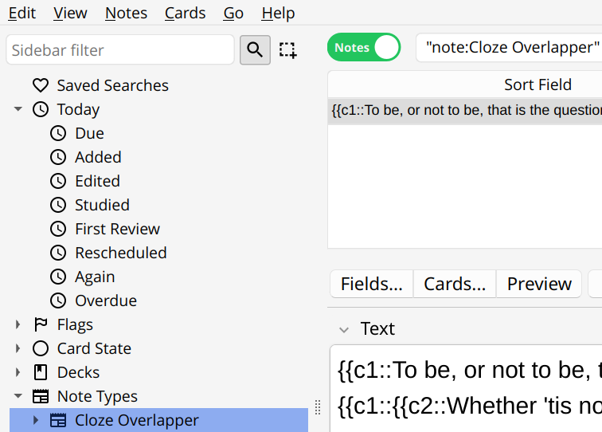
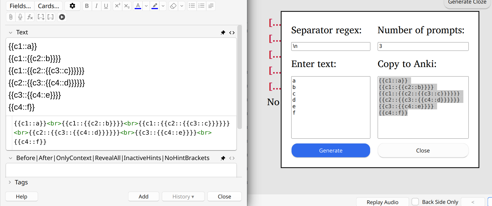
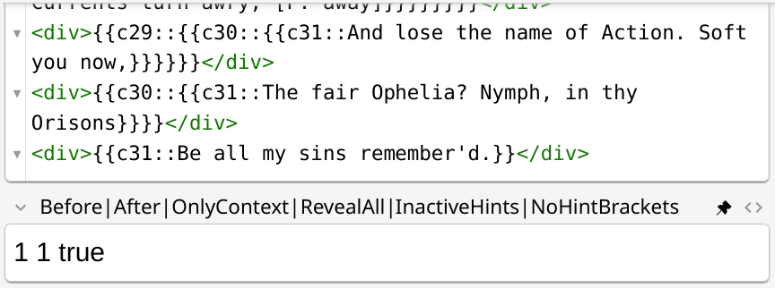
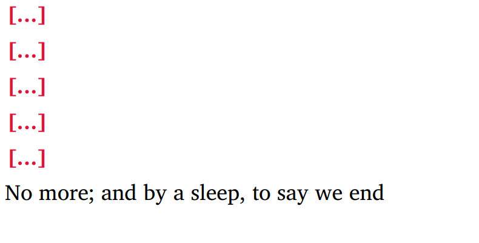
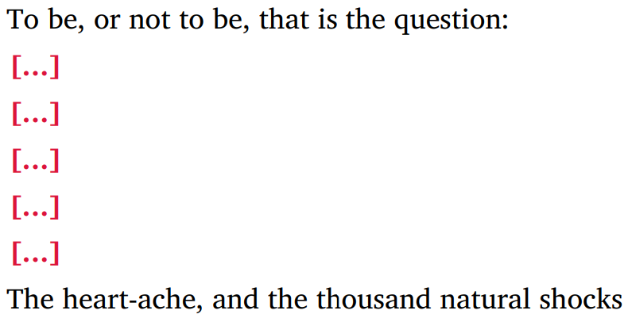
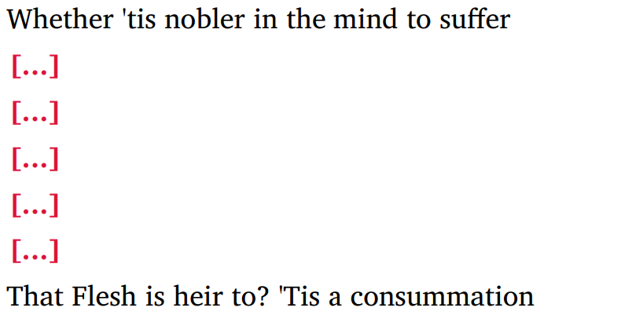

Modern Cloze Overlapper for Anki
================================

This is a rewrite of anki-simple-cloze-overlapper__ in modern JS. For an overview of features,
please take a look at a `usage example`__ in that repository.

__ https://github.com/michalrus/anki-simple-cloze-overlapper
__ https://github.com/michalrus/anki-simple-cloze-overlapper/blob/main/screen-recording.gif

In addition to ``anki-simple-cloze-overlapper`` features, support was added for:

- Nested clozes.
- Clozes in MathJax.
- Cloze Generator.
- Scroll to cloze (MathJax clozes not supported).
- Ability to render user-provided cloze hints without brackets.

The code was tested on all Anki platforms: Desktop, AnkiDroid, AnkiWeb and AnkiMobile.

AnkiDroid requires the latest `Android System WebView`__ to be installed.

__ https://play.google.com/store/apps/details?id=com.google.android.webview

How to Use
----------

#. Place `<_cloze-overlapper-loader.js>`_ and `<_cloze-overlapper.js>`_
   into Anki's `collection.media folder`__.

   __ https://docs.ankiweb.net/media.html#manually-adding-media

#. Create a new note type by cloning the built-in Cloze.
#. Add a rendering configuration field named
   ``Before|After|OnlyContext|RevealAll|InactiveHints|NoHintBrackets``.
#. Put the content of `<front.template.anki>`_ into note's Front Template.
#. Put the content of `<back.template.anki>`_ into note's Back Template.
#. (Optional AnkiDroid compatibility) Add

   .. code:: css

     .android .card:not(.mathjax-rendered) {
         visibility: hidden;
     }

   to note's Styling to hide everything until ``onUpdateHook`` is executed.
   See AnkiDroid's `Advanced formatting`__ for details.

   __ https://github.com/ankidroid/Anki-Android/wiki/Advanced-formatting#hide-content-during-execution-of-onupdatehook

Rendering Configuration
-----------------------

A self-explanatory field ``Before|After|OnlyContext|RevealAll|InactiveHints|NoHintBrackets``
describes the format of the configuration. In addition to pipes, parameters can be separated
by spaces, commas, or dots. Omitted rightmost parameters and non-parsable parameters all fall back
to lower priority configuration sources.

Configuration sources by priority:

#. ``Before|After|OnlyContext|RevealAll|InactiveHints|NoHintBrackets`` field controls
   the rendering of a particular note.
#. ``<template id="default-cloze-config">`` on the front and the back of the template
   provides the defaults for a note type.
#. If a value is not present in either note's or note types' configuration,
   or if it cannot be parsed, the script falls back to hardcoded defaults.

The parameters are as follows:

``Before`` (an integer, defaults to 1)
  The number of clozes before the currently active ones to uncover.
  A negative value will uncover everything before the currently active clozes.

``After`` (an integer, defaults to 0)
  The number of clozes after the currently active ones to uncover.
  A negative value will uncover everything after the currently active clozes.

``OnlyContext`` (Boolean ``true`` or ``false``, defaults to ``false``)
  Show clozes only within the context (before + current + after).
  Set to ``true`` for e.g. long lyrics/poems.

``RevealAll`` (Boolean ``true`` or ``false``, defaults to ``false``)
  Reveal all clozes on the back of the card. By default, only currently active clozes are revealed.
  (Context clozes are revealed even on cards' fronts.)

``InactiveHints`` (Boolean ``true`` or ``false``, defaults to ``false``)
  Use user-provided hints (i.e. ``{{c#::...::user provided hint}}``) for all clozes.
  By default, only the currently active clozes use provided hints, others use ``[...]``.

``NoHintBrackets`` (Boolean ``true`` or ``false``, defaults to ``false``)
  Render user-provided hints without brackets. Note that the default hint ``[...]``
  always renders with brackets.

Context takes nesting of clozes into account: only clozes at the same level of nesting or above
can be considered before of after the current one. In the following example::

  {{c1::outer 1 {{c2::inner {{c3::deep 1}} {{c4::deep 2}} }} }} {{c5::outer 2}}

- ``c1``, ``c2`` and ``c3`` have no clozes before,
- ``c5`` has no clozes after,
- ``c3`` is before ``c4``, and similarly, ``c4`` is after ``c3``,
- ``c5`` is after ``c1``, ``c2`` and ``c4``, but only ``c1`` is before ``c5``.

Recall All Clozes Card
----------------------

If you need an extra card that asks you for all the clozes at once, add another cloze
with ``ask-all`` in its content, e.g. ``{{c99::ask-all}}``.

Styling of Clozes inside MathJax
--------------------------------

CSS ``.cloze`` class doesn't apply inside MathJax. MathJax does support a non-standard
``\class{cloze}{...}`` TeX command; unfortunately it renders very poorly. The styling of MathJax
clozes is thus relegated to TeX macros: ``\AnkiClozeQ`` on the front of the card,
and ``\AnkiClozeA`` on the back of the card.

By default, ``\AnkiClozeA`` is identical to ``\AnkiClozeQ``. The style of ``\AnkiClozeQ`` is taken
from the ``.cloze`` class:

- ``cloze { color: ... }`` is converted to RGB,
  and ``\color[RGB]{RRR, GGG, BBB}`` is added to ``\AnkiClozeQ``.

- If ``cloze { font-style: ... }`` is either oblique or italic,
  ``\AnkiClozeQ`` will have ``\mathit``.

- If ``cloze { font-weight: ... }`` is bold or greater or equal to 700,
  ``\AnkiClozeQ`` will have ``\boldsymbol``.

You can always uncomment the following block in both ``front.template.anki``
and ``back.template.anki``, and redefine ``\AnkiClozeA`` and ``\AnkiClozeA`` as you see fit.

.. code:: html

  <!--
    Uncomment and adjust if MathJax style autodetection doesn't work for you.
    \[
      \renewcommand\AnkiClozeQ[1]{\boldsymbol{\color{blue} #1}}
      \renewcommand\AnkiClozeA[1]{\AnkiClozeQ{#1}}
    \]
  -->

Using the Cloze Generator
-------------------------

Anki has built-in support for nested clozes, but writing such clozes by hand is cumbersome.
Cloze Generator simplifies this process.

In order to use the Cloze Generator, you need to have at least one ‘Cloze Overlapper’ note.
After adding such a note, go to Browser, select a ‘Cloze Overlapper’ note, and click Preview:

Press ‘Generate Cloze’ button in the top right corner of the Preview. Return back to Anki's
main window and click ‘Add’. Place ‘Add’ and ‘Preview’ windows side-by-side as in
the following picture:

Now you can paste the text you want to add clozes to into the ‘Enter text’ field. The generator
will split the given text into chunks by the ‘Separator’ regex, and then wrap every single chunk
with cloze prompts, which is easier than wrapping these chunks by hand. The generated cloze
should be copied from ‘Copy to Anki’ field of the generator to the ‘Text’ field of a new
‘Cloze Overlapper’ note.

Generator's ‘Number of prompts’ field creates nested clozes, which can help when e.g. memorising
poetry. For example, if you were to set the ‘Number of prompts’ to 5 and paste the following
into the generator's ‘Enter text’:

.. code:: txt

  To be, or not to be, that is the question:
  Whether 'tis nobler in the mind to suffer
  The slings and arrows of outrageous fortune,
  ...

the generator will produce the following output:

.. code:: txt

  {{c1::To be, or not to be, that is the question:}}
  {{c1::{{c2::Whether 'tis nobler in the mind to suffer}}}}
  {{c1::{{c2::{{c3::The slings and arrows of outrageous fortune,}}}}}}
  ...

Copy this to the text editor and replace ``^`` regex with ``
``, and ``$`` regex
with ``
`` to get:

.. code:: txt

  
{{c1::To be, or not to be, that is the question:}}

  
{{c1::{{c2::Whether 'tis nobler in the mind to suffer}}}}

  
{{c1::{{c2::{{c3::The slings and arrows of outrageous fortune,}}}}}}

  ...

Paste that into ‘Cloze Overlapper’'s ‘Text’ field's HTML source, and set
``Before|After|OnlyContext|RevealAll|InactiveHints|NoHintBrackets`` to ``1 1 true``:

Now you have a number of cloze cards, which ask you to recall 5 consecutive lines of text
given one line of context before and one line of context after. The first three such cards
are below:

|poetry-1| |poetry-2| |poetry-3|

Similarly, by making appropriate regex replacements of the generator output in a text editor,
you can generate ordered ``<ol>`` or unordered ``<ul>`` lists, etc.

Reloading ``_cloze-overlapper.js``
-----------------------------------

JavaScript modules are not reloaded from disk automatically. In order to reload
``_cloze-overlapper.js``, open DevTools on the Network tab, check “Disable cache”,
and press :kbd:`Ctrl + Shift + R`. It empties the card's page completely, but after navigating to
the next/previous card and back the module is reloaded.

Why JavaScript module?
-----------------------------------

Considering that

#. a non-trivial amount of non-module code is required to load ``_cloze-overlapper.js``;
#. reloading problems that a modularised solution ensues;

one may ask a question why bother with a JS module in the first place? The answer is: rewriting
``_cloze-overlapper.js`` as a non-module introduces a lot of flickering when flipping a cloze card
from its front to its back. JS module doesn't have such a problem (or may be it's just
less noticeable). Probably it has something to do with the fact that modules are loaded and parsed
only once and not on every render.
